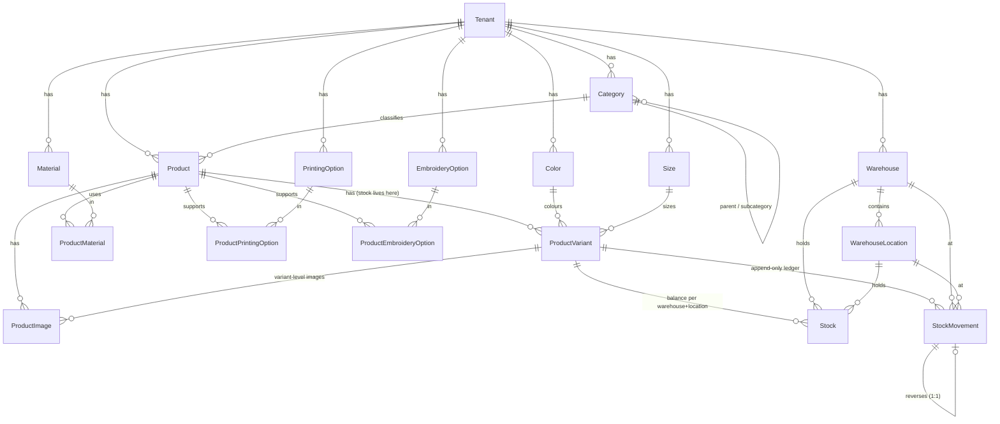
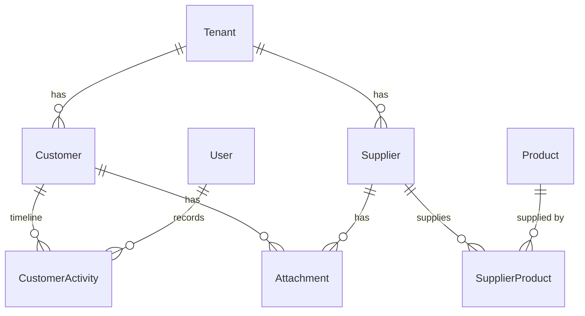
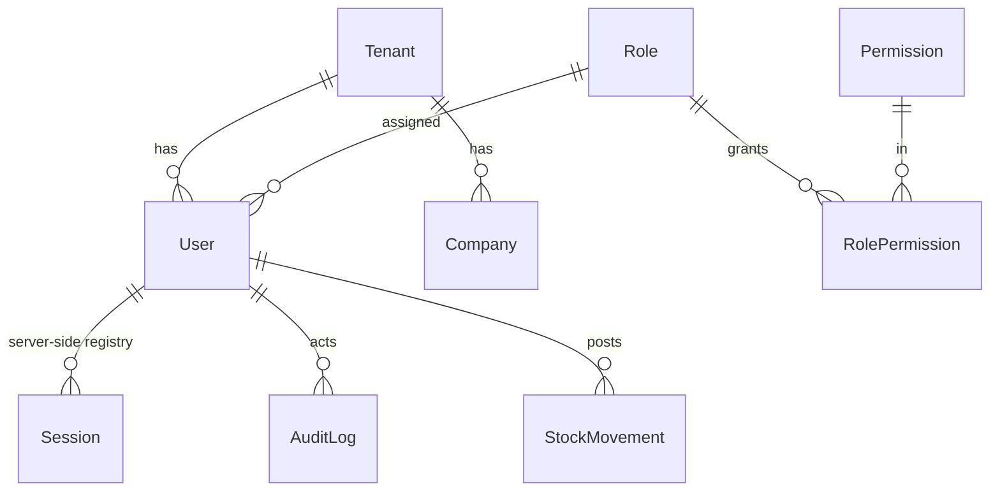

# 13 — Database ER Diagram

**Version:** 1.0 · **Date:** 2026-08-08 · **Tables:** 29
**Source of truth:** `prisma/schema.prisma`

---

## 1. Catalogue and inventory

**The load-bearing decision:** `Stock` and `StockMovement` both hang off
`ProductVariant`, never off `Product`. A product in three colours and five
sizes is fifteen independently stocked things; tracking at product level makes
every figure meaningless.

`Stock` is a **projection** — a running balance kept beside the movement
ledger so a list page need not sum history. `StockMovement` is the record of
truth and is rebuildable into `Stock` at any time (DI-2).

---

## 2. Partners

`Attachment` uses **nullable foreign keys** (`customerId`, `supplierId`)
rather than an `entityType` + `entityId` pair, so the database still enforces
referential integrity. Exactly one owner is set per row.

---

## 3. Identity — frozen at Phase 2

---

## 4. Constraints and indexes

| Table | Unique | Indexes |
|---|---|---|
| `Category` | `(tenantId, slug)` | `(tenantId, isDeleted)`, `parentId` |
| `Product` | `(tenantId, sku)` | `(tenantId, isDeleted)`, `(tenantId, categoryId)`, `barcode` |
| `ProductVariant` | `sku`, `(productId, colorId, sizeId)` | `productId`, `barcode` |
| `ProductImage` | `driveFileId` | `productId`, `variantId` |
| `Color` / `Material` / `PrintingOption` / `EmbroideryOption` | `(tenantId, nameAr)` | `(tenantId, isDeleted)` |
| `Size` | `(tenantId, code)` | `(tenantId, isDeleted)` |
| `Warehouse` | `(tenantId, code)` | `(tenantId, isDeleted)` |
| `WarehouseLocation` | `(warehouseId, code)` | `warehouseId` |
| `Stock` | `(variantId, warehouseId, locationId)` | `variantId`, `warehouseId` |
| `StockMovement` | `reversesId` | `(tenantId, occurredAt)`, `(variantId, occurredAt)`, `warehouseId`, `type` |
| `Customer` / `Supplier` | `(tenantId, code)` | `(tenantId, isDeleted)`, `phone` |

`ProductImage.driveFileId` being unique is what makes the Drive import
idempotent — the same file can never be imported twice.

`StockMovement.reversesId` being unique means a movement can be reversed
exactly once, which the verification suite tests directly.

---

## 5. Soft delete

`isDeleted` + `deletedAt` on: **Product, ProductVariant, Category, Color,
Size, Material, PrintingOption, EmbroideryOption, Warehouse,
WarehouseLocation, Customer, Supplier.**

Transactional data — `StockMovement`, `AuditLog`, `CustomerActivity` — is
never deleted at all. Corrections are reversing entries.

---

## 6. Change Log

| Version | Date | Change |
|---|---|---|
| 1.0 | 2026-08-08 | Initial diagram at 29 tables after the Phase 3 migration. |
